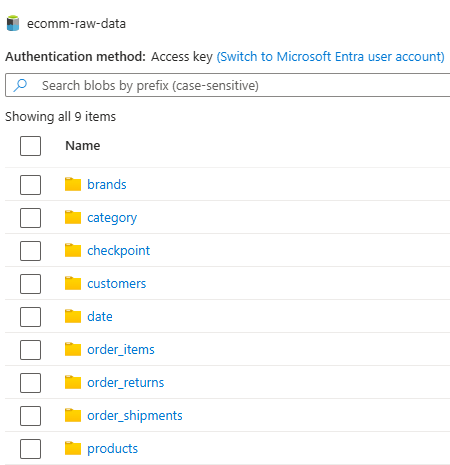
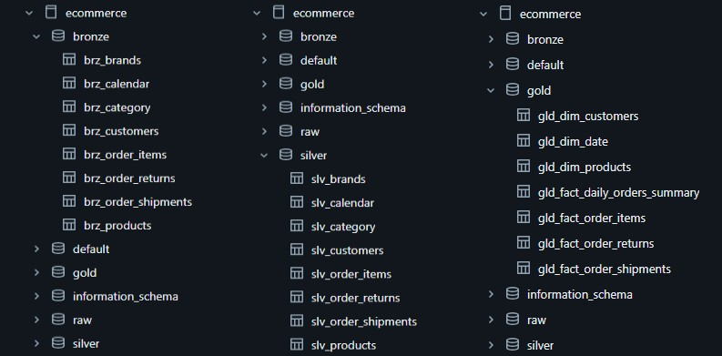
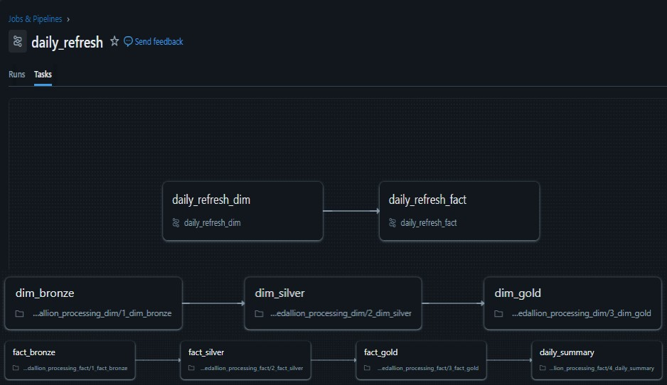
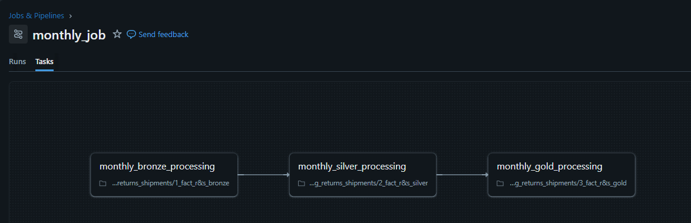
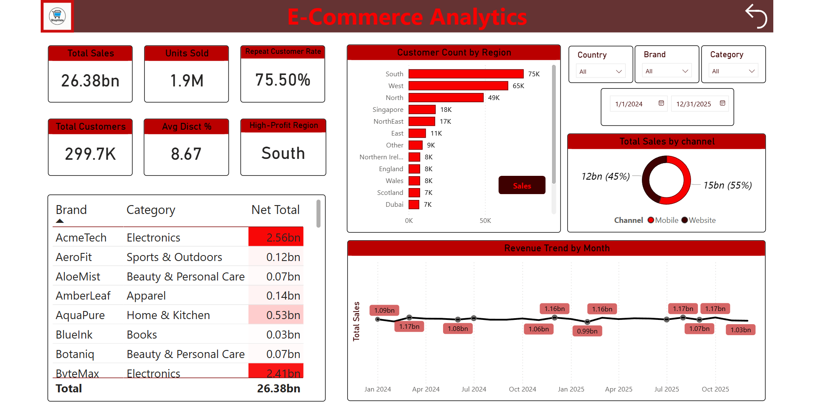

# 🛒 ShopVista – End-to-End E-Commerce Data Engineering Project (Azure Databricks)

## 📌 Project Overview

ShopVista is a rapidly growing e-commerce platform that faced major challenges due to data being scattered across multiple source systems and flat files. Business teams relied on manual data consolidation and static reports, resulting in delayed insights and limited visibility into sales, customers, and operations.

This project delivers a **centralized, scalable, and fully automated data platform on Microsoft Azure**, transforming raw operational data into **analytics-ready datasets** using **Azure Databricks**, **Azure Data Lake Storage Gen2**, and the **Medallion (Bronze → Silver → Gold) architecture**. The final data model powers an interactive **Power BI analytics dashboard** for business decision-making.

---

## 🎯 Business Challenges

- Fragmented data across multiple raw files and systems  
- Manual reconciliation and inconsistent reporting 
- No single source of truth for analytics  
- Slow reporting cycles and limited analytical flexibility 

---

## 🛠️ Solution Approach

A centralized Azure-based data platform was designed to ingest, process, and serve data in a fully automated manner:

- Azure Data Lake Storage Gen2 (ADLS) as the centralized data lake
- Azure Databricks for scalable ETL/ELT processing
- Delta Lake tables for reliability, performance and schema enforcement
- Medallion Architecture (Bronze, Silver, Gold) for progressive data refinement
- Automated Databricks Jobs for daily and monthly orchestration
- Power BI for interactive analytics and reporting

---

## 🧱 Pipeline Architecture (Azure)

**Architecture Highlights:**
1. Source CSV files land in ADLS (Raw zone)
2. Databricks ingests raw data into Bronze tables
3. Data is cleaned, standardized and validated in Silver tables
4. Business-ready fact and dimension tables are created in Gold
5. Power BI consumes Gold tables for analytics and dashboards

---

## 📂 Azure Data Lake – Raw Zone

Raw datasets stored in ADLS include:

This structure enables centralized storage and traceability of source data.

---

## 🥉🥈🥇 Medallion Architecture – Data Layers

### 🥉 Bronze Layer
- Raw ingestion from ADLS
- Minimal transformation
- Schema enforcement
- Historical and audit-friendly storage

---

### 🥈 Silver Layer
- Data cleansing and standardization
- Handling nulls, duplicates and invalid records
- Referential integrity enforcement
- Business-consistent datasets

---

### 🥇 Gold Layer
- Star schema modeling
- Optimized for analytics and BI consumption
- Aggregated and enriched datasets

---

## ⚙️ Job Orchestration & Automation

### 🔁 Daily Refresh Pipeline

- A fully automated **daily Databricks job** was created to process:
  - Dimension tables (Customers, Products, Categories, Brands, Date)
  - Fact Orders data
- Ensures fresh, analytics-ready data every day
- Dependencies enforced between dimension and fact processing, guaranteeing data consistency

---

### 📅 Monthly Processing Pipeline

- A separate **monthly job** processes:
  - Order Returns
  - Order Shipments
- This design optimizes compute usage while supporting accurate historical trend analysis.

---

## 📊 Analytics & Reporting – Power BI

The Power BI dashboard provides actionable insights such as:

- Total Sales & Units Sold
- Repeat Customer Rate
- Customer Distribution by Region
- Sales by Brand & Category
- Monthly Revenue Trends
- Sales Channel Split (Mobile vs Website)
- High-Profit Regions

🔗 **Dashboard Preview:**  
👉 *(Add your Power BI Service / portfolio link here)*

---

## 📈 Business Outcomes

- Eliminated manual data consolidation
- Reduced reporting turnaround from hours to minutes
- Established a single source of truth for analytics
- Enabled real-time, self-service reporting for stakeholders
- Built a scalable and extensible data foundation for future data growth

---

## 🧠 Skills & Concepts Learned

- Azure Data Lake Storage Gen2 (ADLS)
- Azure Databricks & Databricks Jobs
- Delta Lake & Medallion Architecture
- ETL / ELT Pipeline Design
- Data Quality & Validation Techniques
- Fact & Dimension Modeling (Star Schema)
- Incremental & Scheduled Data Processing
- Power BI Data Modeling & Visualization
- End-to-End Cloud Data Engineering

---

## 🙏 Acknowledgements

Special thanks to **Codebasics** for their exceptional **Data Engineering course**, hands-on project guidance, and real-world problem statements that enabled me to design and implement this end-to-end Azure data platform.

---

## 🧰 Tech Stack

- **Cloud:** Microsoft Azure  
- **Storage:** Azure Data Lake Storage Gen2  
- **Processing:** Azure Databricks (PySpark, SQL)  
- **Data Format:** Delta Lake  
- **Orchestration:** Databricks Jobs  
- **Visualization:** Power BI  

---
